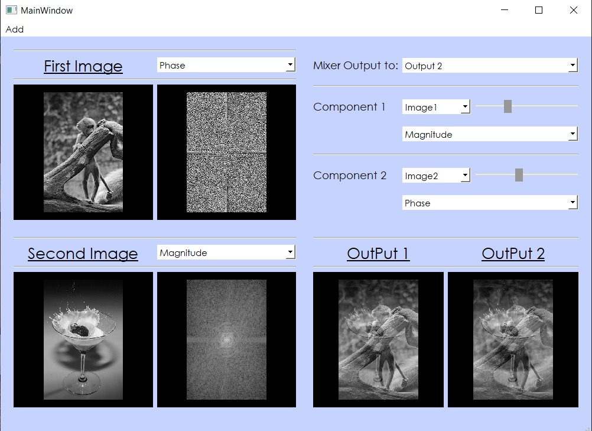

# Image component mixer 

### The core of signal processing is using Fourier transform.

- The main components of any signal(or image) are the phase and magnitude. We are gonna show how important is the phase and to what extent it has most of weight of image details.  

- About the app:
  
  - Mixing two images' component whether: 
      * magnitude component with phase or uniphase component.
      * real component with imaginary one

    and vice versa.
  
  - You have two windows for output.
  - You can control the weight of selected component of each image to be mixed.
  - There is a logging file to trace steps made by the user during using the app.

***

It was a team project done by:

[Marwa Abdelaal](https://github.com/MarwaAbdelAal), 
[Meirna Kamal](https://github.com/Meirna-kamal), 
[Nada Ezzat](https://github.com/nadaezzat-99), 
[Noura Mahmoud](https://github.com/Noura-Mahmoud)

***
